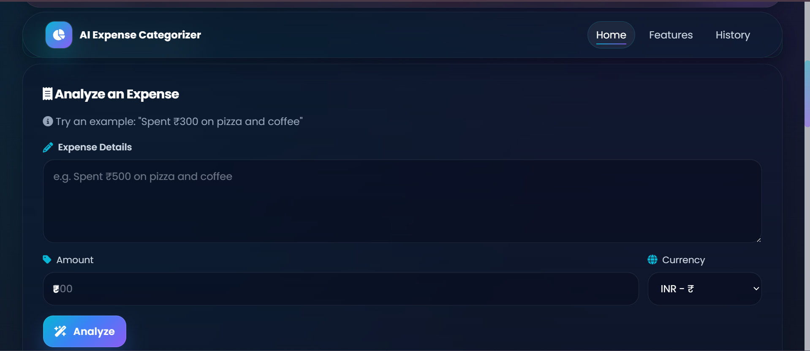
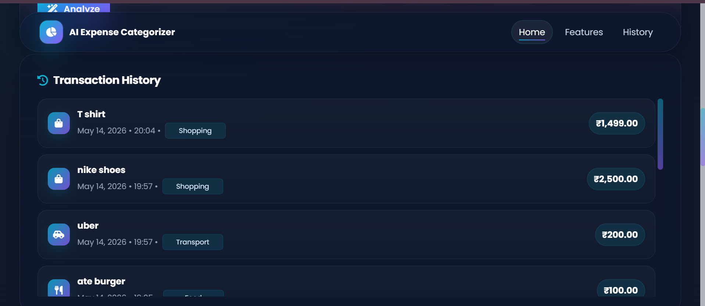
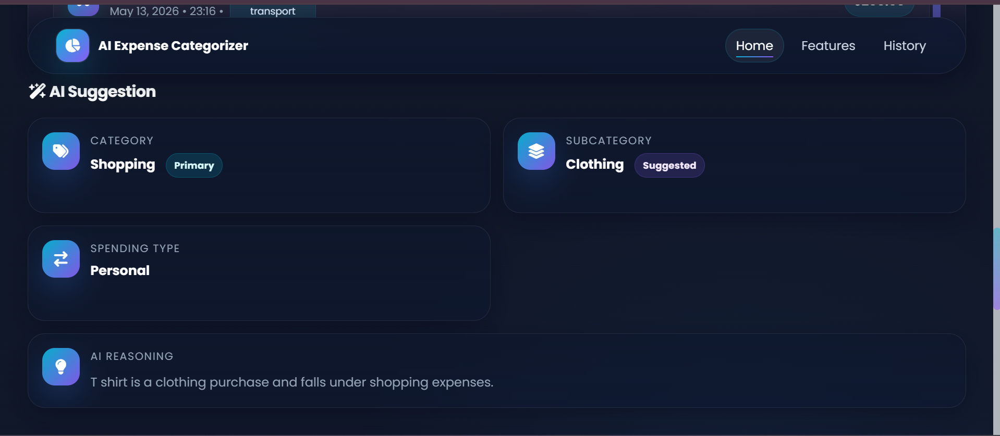
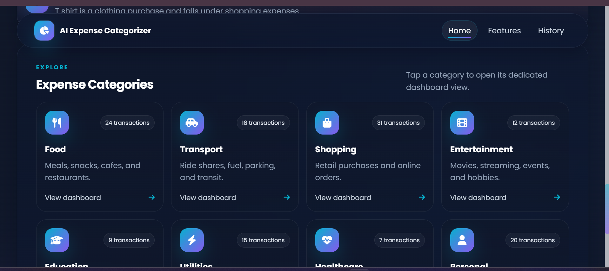

# AI Expense Categorizer

## Project Overview
AI Expense Categorizer is an AI-powered expense tracking web application built with PHP and MySQL.

You can enter a plain-language expense like:
"Spent 300 on pizza and coffee"

The app sends the expense text to an AI model through OpenRouter, receives structured categorization data, and stores the result in MySQL for display in a modern dashboard.

## Features
- AI-powered expense categorization
- Smart subcategory prediction
- AI-generated reasoning
- Dynamic transaction history
- Category-wise filtering
- Responsive dark-themed dashboard
- INR currency support

## Tech Stack
### Frontend
- HTML
- CSS
- JavaScript

### Backend
- PHP

### Database
- MySQL

### AI
- OpenRouter API

## Project Structure
```text
ai-expense-categorizer/
├── assets/
│   ├── icons/
│   └── images/
├── components/
│   ├── category_cards.php
│   ├── expense_form.php
│   ├── hero.php
│   ├── history_section.php
│   ├── navbar.php
│   └── result_card.php
├── database/
│   └── schema.sql
├── categorize.php
├── category.php
├── config.example.php
├── config.php
├── db.php
├── fetch_history.php
├── index.php
├── save_expense.php
├── script.js
├── style.css
└── test_gemini.php
```

## Installation and Setup

### 1. XAMPP Setup
1. Install XAMPP.
2. Place this project folder inside your `htdocs` directory.
3. Start `Apache` and `MySQL` from the XAMPP Control Panel.
4. Open the app in your browser:

```text
http://localhost/ai-expense-categorizer/
```

### 2. Database Setup
1. Open phpMyAdmin:

```text
http://localhost/phpmyadmin
```

2. Create a new database named:

```text
ai_expense_categorizer
```

3. Import the SQL file:

```text
database/schema.sql
```

### 3. config.php Setup
1. Copy the example config file:

```bash
copy config.example.php config.php
```

2. Open `config.php` and add your OpenRouter API key.
3. Keep `config.php` private and never commit real keys to Git.

Example:

```php
<?php
$openRouterApiKey = "YOUR_OPENROUTER_API_KEY";
?>
```

## Screenshots

### Analyze Expense Dashboard


### Transaction History


### AI Suggestions & Insights


### Expense Categories Dashboard


## Future Improvements
- Voice input
- Monthly analytics
- Receipt scanning
- Budget recommendations

## Author
Sharayu Kotkar

